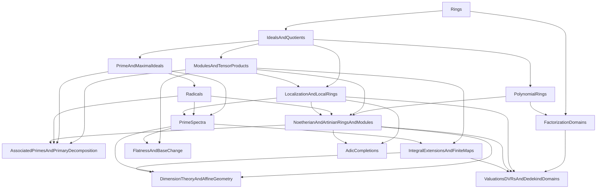

# Ring Theory and Commutative Algebra — exercises overview

These sheets form a course in commutative algebra. They begin with rings and ideals, separate the
algebra of ideals from the theory of prime ideals and radicals, then develop modules, locality,
geometry, arithmetic, and formal-local algebra.

## Course sequence

### Ring-theoretic foundations

1. `01Rings` — ring homomorphisms, units, zero divisors, domains, products, characteristic, and
   standard examples.
2. `02IdealsAndQuotients` — generated and principal ideals, ideal operations, quotient rings,
   kernels, inverse images, quotient universal properties, Chinese remainders, and idempotent
   decompositions.
3. `03PrimeAndMaximalIdeals` — prime and maximal ideals, their behavior under ring maps,
   quotient criteria, product-ring examples, and prime avoidance.
4. `04Radicals` — radical ideals, nilpotents, nilradicals, the
   Jacobson radical, and prime-ideal descriptions of radicals.
5. `05PolynomialRings` — polynomial rings, evaluation, roots, division over fields, the factor
   theorem, multivariable polynomial rings, and ideals in polynomial rings.
6. `06FactorizationDomains` — divisibility, gcds, Bezout identities, Euclidean domains, PIDs,
   UFDs, irreducibles, primes, and Gauss's lemma.

### Modules, locality, and finiteness

7. `07ModulesAndTensorProducts` — modules and submodules, quotient modules, module
   homomorphisms, exact sequences, finite generation, direct sums, tensor products, and scalar
   extension.
8. `08LocalizationAndLocalRings` — localization of rings and modules, extension and contraction
   of ideals under localization, localization at prime ideals, local rings, and residue fields.
9. `09NoetherianAndArtinianRingsAndModules` — Noetherian and Artinian rings and modules,
   Hilbert's basis theorem, finite-length modules, Nakayama's lemma, and Noetherian radical
   finiteness.
10. `10AssociatedPrimesAndPrimaryDecomposition` — associated primes, zero divisors on modules,
    primary ideals and modules, minimal primes, primary decomposition, and localization of
    decompositions.

### Geometric commutative algebra

11. `11PrimeSpectra` — prime spectra, the Zariski topology, closed subsets `V(I)`, basic opens
    `D(f)`, maps of spectra, and one-point spectra.
12. `12IntegralExtensionsAndFiniteMaps` — integral elements, finite ring maps, integral closure,
    lying over, going up, and the behavior of prime spectra under integral maps.
13. `13FlatnessAndBaseChange` — flat and faithfully flat modules and maps, tensoring and
    exactness, and base change.
14. `14DimensionTheoryAndAffineGeometry` — Krull dimension, dimension of finite-type algebras,
    Noether normalization, the principal ideal theorem, the Nullstellensatz, and affine algebraic
    geometry.

### Arithmetic and formal-local algebra

15. `15ValuationsDVRsAndDedekindDomains` — valuations, DVRs, normal domains, fractional ideals,
    Dedekind domains, and ideal factorization.
16. `16AdicCompletions` — adic topologies, completion, associated graded and Rees constructions,
    and completions of local rings.

## References

- D. S. Dummit and R. M. Foote, *Abstract Algebra*.
- M. F. Atiyah and I. G. Macdonald, *Introduction to Commutative Algebra*.
- D. Eisenbud, *Commutative Algebra with a View Toward Algebraic Geometry*.
- H. Matsumura, *Commutative Ring Theory*.
- The Stacks Project, *Commutative Algebra*.
- MIT [18.705](https://math.mit.edu/~etingof/18.705syll.pdf) and University of Michigan
  [Math 614](https://websites.umich.edu/~mmustata/CAnotes.pdf).

## Corresponding Mathlib areas

`Mathlib.Algebra.Ring.*`, `Mathlib.RingTheory.Ideal.*`,
`Mathlib.RingTheory.Polynomial.*`, `Mathlib.Algebra.EuclideanDomain.*`,
`Mathlib.RingTheory.UniqueFactorizationDomain.*`, `Mathlib.Algebra.Module.*`,
`Mathlib.LinearAlgebra.TensorProduct.*`, `Mathlib.RingTheory.Localization.*`,
`Mathlib.RingTheory.Spectrum.*`, `Mathlib.RingTheory.LocalRing.*`,
`Mathlib.RingTheory.Noetherian.*`, `Mathlib.RingTheory.IntegralClosure.*`,
`Mathlib.RingTheory.KrullDimension.*`, `Mathlib.RingTheory.DedekindDomain.*`, and the relevant
valuation and completion modules.

## Topic dependency graph

An edge `A --> B` means that **B** uses ideas or results developed in **A**; it does not require
an import from every earlier sheet.

